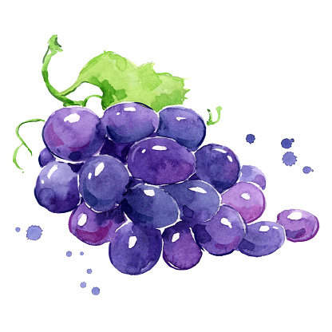

# All about grapes

## grapes are a fruit

### grapes are not a vegetable and are not a berry and are not a nut.

http://localhost:3000/buttons

> "Grapes are a fruit, botanically speaking, because they contain seeds. They are not a berry, because they have a single ovary, and they are not a nut, because they do not have a hard shell." - someone

The background color should be `#000000` for light mode and `#0d1117` for dark mode.

| left   | center | right |
| :----- | :----: | ----: |
| foo    |  bar   |   baz |
| banana | apple  |  kiwi |